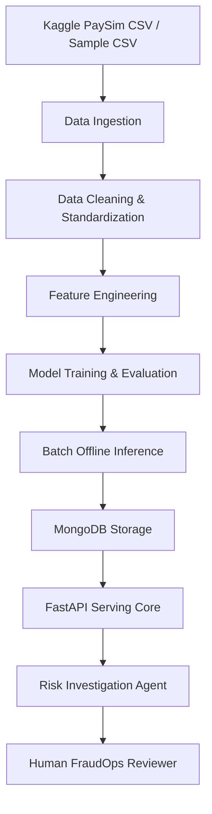

# Fintech FraudOps Copilot
### AI/Data Engineering Pipeline for Fraud Detection with Risk Investigation Agent

A prototype Fintech fraud detection platform featuring an end-to-end Data Engineering & Machine Learning pipeline, coupled with an AI-driven **Risk Investigation Agent** to analyze, classify, and explain fraudulent transactions.

> **Scope Statement:** This project is a prototype offline batch fraud detection system.
> It is **not** a production wallet, payment processor, or real-time fraud engine.

---

## 📌 Problem Statement
In digital banking and digital wallets, fraud detection is a high-stakes cat-and-mouse game. Static threshold-based rules fall short when facing complex fraud strategies. 
**Fintech FraudOps Copilot** bridges this gap. It constructs an offline data engineering and machine learning lifecycle that profiles transaction data, builds robust behavioral features, trains an AI fraud classifier, runs batch inference, and presents findings to human FraudOps investigators through an automated **Risk Investigation Agent**.

---

## 📊 Dataset: Kaggle PaySim
This project integrates the popular **PaySim** mobile money simulator dataset (specifically `ealaxi/paysim1` from Kaggle). 
PaySim simulates mobile money transactions based on real logs of financial operations, providing an excellent benchmark for fraud detection research.
- **Transaction Types**: `TRANSFER`, `CASH_OUT`, `CASH_IN`, `PAYMENT`, `DEBIT`
- **Imbalance**: Fraud cases represent a tiny fraction (~0.1%) of overall volume, simulating real-life fraud distribution.

---

## 🏗️ Architecture Flow
The platform is designed around a decoupled, highly auditable data-and-insights flow:



1. **Ingestion**: Download and ingestion of CSV dataset.
2. **Cleaning**: Column standardizations (e.g. `camelCase` to `snake_case`) and type conversions.
3. **Feature Engineering**: Constructing high-value features (e.g., origin balance error, merchant flag, type dummies).
4. **Model Training**: Training a Logistic Regression baseline and a Random Forest Classifier champion.
5. **Batch Inference**: Offline predictions computing fraud probabilities and assigning risk categories.
6. **MongoDB Serving**: Storing predictions, features, and transactions with optimal lookups.
7. **FastAPI Serving Core**: Powering transactional, risk, and agentic API routes.
8. **Risk Investigation Agent**: Rule-based MVP synthesizing signals into readable, actionable markdown analysis reports.

---

## 📂 Project Structure

```text
Fintech-FraudOps-Copilot/
├── app/
│   ├── main.py                     # App bootstrap & router registrations
│   ├── config.py                   # Environment settings loader
│   ├── database.py                 # Async MongoDB (Motor) connection manager
│   │
│   ├── modules/                    # API Endpoints
│   │   ├── transactions/           # PaySim transaction readers
│   │   │   ├── router.py
│   │   │   ├── service.py
│   │   │   ├── repository.py
│   │   │   └── schema.py
│   │   │
│   │   ├── risk/                   # ML prediction scores, risk mapping rules
│   │   │   ├── router.py
│   │   │   ├── service.py
│   │   │   ├── repository.py
│   │   │   └── schema.py
│   │   │
│   │   ├── analytics/              # Statistics & distribution dashboards
│   │   │   ├── router.py
│   │   │   ├── service.py
│   │   │   └── schema.py
│   │   │
│   │   └── agents/                 # AI Risk Investigation Agent
│   │       ├── router.py
│   │       ├── service.py
│   │       ├── schema.py
│   │       ├── tools.py
│   │       └── prompts.py
│   │
│   └── common/                     # Shared exceptions, utilities & responses
│
├── pipelines/                      # Data & ML Engineering Pipelines
│   ├── ingestion/
│   │   ├── download_kaggle_dataset.py  # Download from Kaggle
│   │   └── load_raw_csv.py             # Common pandas CSV loader
│   │
│   ├── processing/
│   │   ├── profile_data.py             # Generates reports/data_profile.md
│   │   ├── clean_paysim.py             # snake_case column transformations
│   │   └── feature_engineering.py      # Computes mathematical ML features
│   │
│   ├── training/
│   │   ├── train_model.py              # LogisticRegression & RandomForest training
│   │   └── evaluate_model.py           # Generates reports/model_report.md
│   │
│   └── inference/
│       └── batch_predict.py            # Computes offline prediction logs
│
├── scripts/                        # Orchestrators and Seeding Helpers
│   ├── run_pipeline.py                 # Sequentially runs the complete ML pipeline
│   ├── import_transactions_to_mongo.py # Imports processed CSVs to MongoDB
│   ├── reset_db.py                     # Clears MongoDB collections
│   └── seed_sample_data.py             # Fast seeding of 10 sample records for API testing
│
├── data/                           # Git-ignored local data directories
│   ├── raw/                        # Large raw Kaggle dataset (.gitkeep)
│   ├── processed/                  # Cleaned CSV & predictions (.gitkeep)
│   ├── features/                   # Feature-engineered dataset (.gitkeep)
│   └── sample/
│       └── paysim_sample.csv       # Small 10-line CSV for rapid local sandbox runs
│
├── models/                         # Trained model storage (.gitkeep)
├── notebooks/
│   └── fintech_fraud_eda.ipynb     # Jupyter Notebook skeleton for EDA
├── reports/                        # Auto-compiled markdown reports
│   ├── data_profile.md             # Dataset distribution profile
│   ├── metrics.json                # Training precision/recall/F1 metrics
│   └── model_report.md             # Model comparison metrics
│
├── tests/                          # Automated Pytest Suite
│   ├── test_common.py              # Validates shared constants & exceptions
│   ├── test_feature_engineering.py  # Validates ML feature construction
│   ├── test_risk_rules.py          # Validates probability to risk mappings
│   └── test_agent.py               # Validates Risk Investigator Agent reports
│
├── AGENTS.md                       # LLM Developer guidelines
├── README.md                       # This file
├── requirements.txt                # Main package dependencies
├── .env.example
├── .gitignore
└── docker-compose.yml
```

---

## ⚙️ Quick Start

### 1. Prerequisites
- **Python 3.10+**
- **MongoDB** (Local instance or MongoDB Atlas)

### 2. Environment Setup
Create a python virtual environment and install the required dependencies:
```bash
python -m venv venv
# Windows PowerShell:
.\venv\Scripts\Activate.ps1
# Unix:
source venv/bin/activate

pip install -r requirements.txt
cp .env.example .env
```

Ensure your `.env` contains a valid `MONGODB_URL` and `DATABASE_NAME`.

---

## 🚀 How to Run the Pipeline
The system comes with an orchestrator script that runs the entire ETL & ML cycle locally using the sample dataset `data/sample/paysim_sample.csv` (No Kaggle account required!).

To trigger the orchestrator:
```bash
python scripts/run_pipeline.py
```
This script will sequentially:
1. Profile raw transactions -> generate `reports/data_profile.md`
2. Clean data columns -> export `data/processed/paysim_clean.csv`
3. Engineer mathematical features -> export `data/features/paysim_features.csv`
4. Train baseline and champion models -> export `models/fraud_model_v1.joblib` & `reports/metrics.json`
5. Evaluate results -> compile `reports/model_report.md`
6. Run offline predictions -> export `data/processed/predictions.csv`
7. Import all outputs to MongoDB & configure database indexes.

---

## 🛠️ How to Run the API
To test endpoints without executing the pipeline, seed sample test data directly to your MongoDB:
```bash
python scripts/seed_sample_data.py
```

Then start the FastAPI development server:
```bash
uvicorn app.main:app --reload --host 127.0.0.1 --port 8000
```
- **API BASE URL**: `http://127.0.0.1:8000/`
- **Swagger Docs**: `http://127.0.0.1:8000/docs`

---

## 📡 Core API Endpoints

### 1. Transactions API
- **`GET /transactions`**: List paginated transactions imported from PaySim.
- **`GET /transactions/{transaction_id}`**: Get specific transaction attributes.

### 2. Risk Analysis API
- **`GET /risk/high-risk-transactions`**: Retrieve list of high-risk transactions (probability >= 70%) sorted by severity.
- **`GET /risk/summary`**: Retrieve database-aggregated risk distribution metrics.

### 3. Analytics API
- **`GET /analytics/fraud-rate`**: Actual ground truth fraud occurrences rate.
- **`GET /analytics/transaction-types`**: Transaction counts categorized by type.

### 4. Risk Investigation Agent API
- **`GET /agents/risk-investigator/{transaction_id}`**: Trigger the Risk Investigation Agent. Combines transaction characteristics and model prediction to compile a highly descriptive, human-readable markdown risk analysis report in Vietnamese.

---

## 🤖 Risk Investigation Agent
The **Risk Investigation Agent** integrates core domain expertise and machine learning predictions:

### Risk Assessment Rules
- `fraud_probability < 0.3` => **LOW RISK** (Action: `APPROVE`)
- `0.3 <= fraud_probability < 0.7` => **MEDIUM RISK** (Action: `MANUAL_REVIEW`)
- `fraud_probability >= 0.7` => **HIGH RISK** (Action: `BLOCK`)

### Suspicious Signal Synthesizer
The agent automatically raises flags when detecting:
- **Type TRANSFER or CASH_OUT**: Historically represents high-probability fraud channels.
- **Origin Account Emptied**: Balance becomes exactly `0.0` after transfer.
- **Balance Errors**: Origin account balance reduction does not match transaction amount.
- **Zero Receivables**: Destination customer balance remains at `0.0` even after a large transfer.

---

## 🧪 Testing
Run our comprehensive pytest suite verifying common configurations, feature engineering logic, mapping rules, and the AI agent:
```bash
pytest
```

---

## ⚠️ Limitations & Future Improvements
1. **Rule-Based Agent MVP**: The current agent runs on a structured, rule-based reasoning engine. Future releases will connect this agent to LLM processors (e.g. Gemini 1.5 Pro) utilizing the `prompts.py` context.
2. **Offline Pipelines**: Real-time Kafka streaming processing could be configured to transition this from an offline batch pipeline to a streaming inference model.
3. **No Frontend Dashboard**: The system currently exposes only a FastAPI Swagger UI. A dedicated investigation dashboard could be built in the future.
4. **Sample Data Only**: The included `paysim_sample.csv` contains only 10 rows. Full-scale testing requires downloading the Kaggle PaySim dataset.
